# DDD - "Dead Drop Daemon"

**Repository:** [github.com/andrey-stepantsov/ddd](https://github.com/andrey-stepantsov/ddd)

## DDD: The Triple-Head Development Architecture

DDD is a physical-to-virtual bridge that allows modern AI agents and host tools to control a persistent, isolated build container.

### 1. The Architecture

The system runs as three distinct "Heads" that communicate solely through the file system. This allows any component to run in any environment (Host, Container, or Cloud) as long as they share the `.ddd` directory.

* **The Builder:** Holds the compiler state, object files, and dependencies.
* **The Watcher (Daemon):** Watches for signals, triggers builds, filters logs, and runs verification.
* **The Coder (AI/You):** Edits source code and signals when ready.

```mermaid
graph TD
    %% Nodes
    Coder[("👤 Coder / AI")]
    Daemon[("👀 Watcher (Daemon)")]
    Builder[("🛠 Builder")]
    Files["📂 .ddd/ Interface"]

    %% Interactions
    Coder -- "1. Touches build.request" --> Files
    Daemon -- "2. Detects Signal" --> Files
    Daemon -- "3. Executes Command" --> Builder
    Builder -- "4. Raw Output" --> Daemon
    Daemon -- "5. Filters & Writes" --> Files
    Coder -- "6. Reads build.log" --> Files

    %% Styling - High Contrast & Environment Agnostic
    %% Files: Center Hub (Orange)
    style Files fill:#ffe0b2,stroke:#ef6c00,stroke-width:2px,color:black
    
    %% Daemon: White with Blue Border (High Contrast)
    style Daemon fill:#ffffff,stroke:#0277bd,stroke-width:3px,color:black
    
    %% Ends: Soft Green and Grey
    style Builder fill:#e8f5e9,stroke:#2e7d32,stroke-width:2px,color:black
    style Coder fill:#f5f5f5,stroke:#616161,stroke-width:2px,color:black
```



### 2. The Clean Structure

DDD uses a dedicated hidden directory to avoid polluting your source tree.

    YourProject/
    ├── src/
    └── .ddd/                <-- Isolated DDD Context
        ├── config.json      <-- Target definitions
        ├── filters/         <-- Project-specific Plugins
        ├── build.request    <-- The Trigger (touch this)
        ├── build.log        <-- AI Log (Filtered, clean)
        └── last_build.raw.log <-- Human Log (Raw, full detail)

### 3. The Protocol (How to use)

To prevent infinite loops and broken builds, the Daemon **ignores all file changes** except one.

1.  **Edit:** Modify as many files as needed.
2.  **Signal:** Run `touch .ddd/build.request`.
3.  **React:** Daemon sees signal -> Runs Build -> Runs Verify.
4.  **Feedback:** Read `.ddd/build.log` to check for errors and iterate.

### 4. Configuration

Create `.ddd/config.json` in your project root to define your targets.

```json
{
  "targets": {
    "dev": {
      "build": {
        "cmd": "make -j4",
        "filter": ["gcc_make", "gcc_json"],
        "path_strip": ""
      },
      "verify": {
        "cmd": ".ddd/scripts/verify.sh",
        "filter": "raw"
      }
    }
  }
}
```

### 5. The Pipeline Workflow

DDD processes the "Build" and "Verify" stages independently, filters their output, and concatenates the results into a single log file for the AI.

```mermaid
graph LR
    Trigger(Trigger) -->|Start| Pipeline

    subgraph Pipeline["Daemon Pipeline"]
        direction TB
        
        subgraph Stage1["Stage 1: Build"]
            Cmd1[Make] --> Buf1[Buffer]
            Buf1 --> F1[Filter: gcc_make]
            F1 --> F2[Filter: gcc_json]
            F2 --> Res1[Clean Errors]
        end

        subgraph Stage2["Stage 2: Verify"]
            Cmd2[Test Script] --> Buf2[Buffer]
            Buf2 --> F3[Filter: Raw]
            F3 --> Res2[Test Results]
        end
    end

    Res1 --> Final[Concatenate]
    Res2 --> Final
    Final --> Log["📄 build.log"]
```



### 6. Advanced Features

#### Filter Chaining
You can pipe the output of one filter into another by providing a list of strings in `config.json`.
* **Example:** `["gcc_make", "gcc_json"]`
* **Flow:** `Raw Output` -> `gcc_make` (Cleans noise) -> `gcc_json` (Formats to JSON) -> `build.log`.

#### Structured Logging (JSON)
The `gcc_json` filter parses standard GCC/Clang error messages into machine-readable JSON. This allows AI agents to ingest errors programmatically rather than guessing from text blobs.

**Output Format:**
```json
[
  {
    "file": "main.c",
    "line": 10,
    "col": 5,
    "type": "error",
    "message": "expected ';'"
  }
]
```

### 7. Setup

1.  **Install:** `./install.sh`
2.  **Run:** `dd-daemon` inside your project root.

### 8. Custom Plugins

DDD supports a "Cascade" loading system for build parsers.
* **Project Local:** `.ddd/filters/*.py`
* **User Global:** `~/.config/ddd/filters/*.py`
* **Built-in:** `src/filters/*.py`

**How to write a plugin:**
Create `.ddd/filters/my_tool.py`:

```python
from src.filters import register_filter
from src.filters.base import BaseFilter

@register_filter("my_tool")
class MyToolFilter(BaseFilter):
    def process(self, text: str) -> str:
        return "Parsed: " + text
```

**Testing Plugins:**
Run the test runner to verify your custom filters:
    
    ddd-test